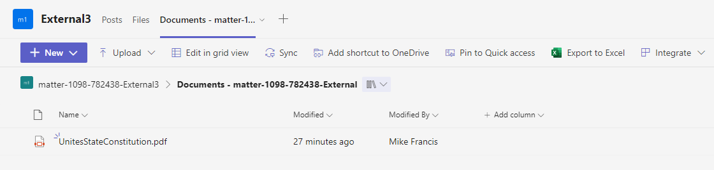
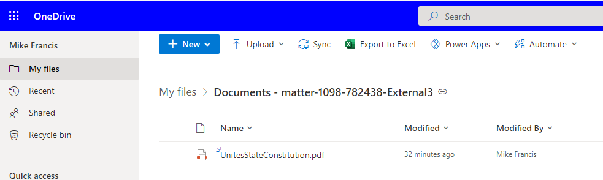

## External File Share by Channel

Prerequisites: 
1) External File Sharing is disabled for all Teams. By default, external file sharing is enabled. https://learn.microsoft.com/en-us/sharepoint/turn-external-sharing-on-or-off

2) Name of the 'Documents' folder is the same name as the Team. If Team is named 'HelloWorld', the folder name should be named 'HelloWorld-Documents'.

Requirement: For a given Team, external file sharing is disabled by default. External file sharing is required for specific channels named for external sharing.

Current workaround: Create a separate 'external share' SharePoint site for external file Sharing
Limitations:
1) No 'Add Shortcut to OneDrive' not available on the tool bar.


2. Mitigation: When the 'external share' SharePoint site is created:

      1) Rename the 'Documents' folder to 'External Documents' and Team Name. For example: 
      
         ```External Documents - Contoso - matter-12345-678900```
      2. In SharePoint, navigate to this document library and copy the URL to the clipboard.
      2. When creating the Team, add a SharePoint site (not Documents Library or Pages) tab. 
         1. Click the + to add an app
         2. Select the SharePoint icon
         3. Paste the link captured in the step above

      Your Teams Tabs should look like this:
      

      Note: Ths 'Add shortcut to OneDrive' link is now available.

      Here is the File shortcut in OneDrive:
       
   

2) Shortcuts to OneDrive (Team SharePoint and External File Sharepoint) have unrelated folder names. For example 'Documents TestClint-TestMatter-XXXXXX' and 'Shared Documents'.

Mitgation: See the step above for creating the 'external share' SharePoint site. Renaming the Document site as suggested will place these nearby each other in File Explorer.


2) Team owners don't receive external access expiration notifications go to Team owners.

Mitigation:  When a Team is created, a User Group is created in AAD. Modify the permission of the External File Sharepoint site and grant access to this user group. Make sure the update the Owners of the site to match the owners as listed in the AAD group.


