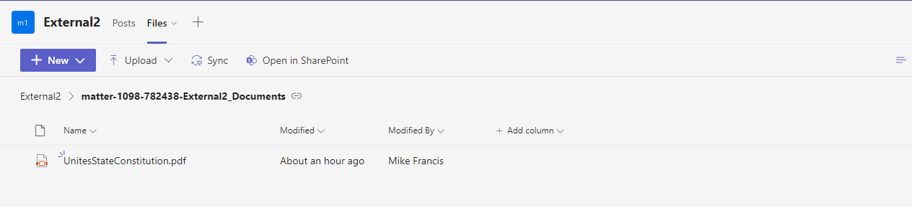
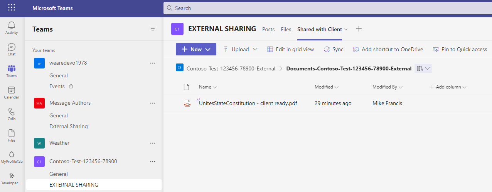
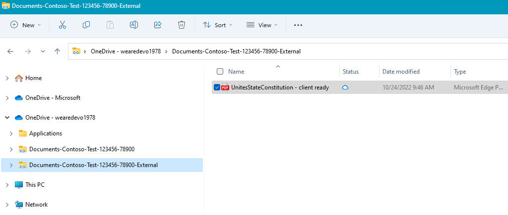
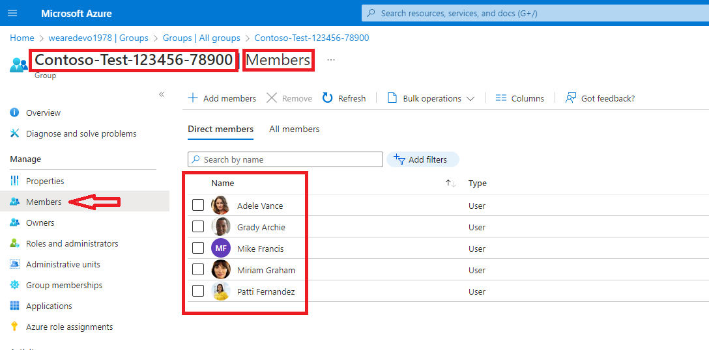
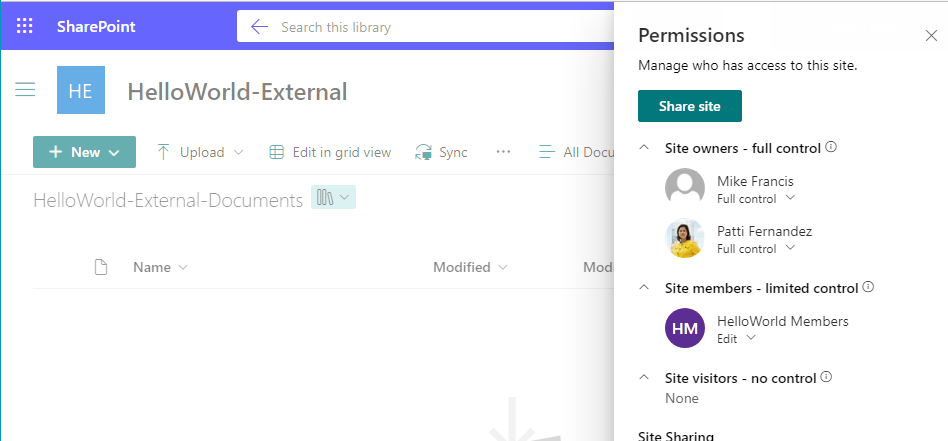

## External File Share by Channel

Requirement: For a given Team, external file sharing is disabled by default. External file sharing is required for specific channels named for external sharing. The following is a workaround that should satisfy most external document sharing requirements.

Prerequisites and Assumptions : 
1) External File Sharing is disabled for all Teams. By default, external file sharing is enabled. https://learn.microsoft.com/en-us/sharepoint/turn-external-sharing-on-or-off

2) The name of the 'Documents' folder is the same as the Team. If the Team is named 'HelloWorld', the folder name should be named 'HelloWorld-Documents'.

Current workaround: Create a separate 'external share' SharePoint site for external file Sharing
Limitations:
1) No 'Add Shortcut to OneDrive' not available on the toolbar.

With improved workaround:


2) Shortcuts to OneDrive (Team SharePoint and External File Sharepoint) have unrelated folder names. For example 'Documents TestClint-TestMatter-XXXXXX' and 'Shared Documents'.
With improved workaround:


3) Team owners don't receive external access expiration notifications go to Team owners.

The above limitations are addressed by the following improved workaround:
1) Create a private Team from scratch: Contoso-Test-123456-78900
2. Add members and owners. 

```Note: An ADD Group is created with the name of the Team and the respective owners and members:```


3. Rename Documents Folder (Documents-[Team Name]). This will disambiguate OneDrive shortcuts

    1. Go to General channel | Files | Open in SharePoint
    2. Click Gear in the upper right and select **Library settings**
    3. Rename **'Documents'** to **'Documents-[Team name]'**
    4. Sharing permissions for this site should be: **'Only people in your organization**.

4. Create a new SharePoint communications site for external sharing
   1. Open SharePoint admin center https://[domain]-admin.sharepoint.com/
   2. Note the name of the SharePoint site created when the Team was created. Copy the name to the clipboard.
   3. Click '+ Create'
   4. Site name: [Team name]-External
   5. Site owner: Your name (you will remove later)
   6. Click 'Finish'
   
5. Set Sharing settings on the new SharePoint Site
   1. In SharePoint Admin Center
   2. Select new site
   3. Select 'Sharing'
   4. External Sharing: 'New and existing guests'
   5. Expiration of guest access: Per your company policy
   6. Default sharing link type: 'Specific people (only the people the user specifies)'
   7. Default link Permission: 'View'
   8. Click 'Save'

6. Open the new site and rename the Documents folder
   1. In SharePoint Admin Center
   2. Select the URL to open the new SharePoint Site
   3. Select 'Documents'
   4. Click Gear in the upper right and select **Library settings**
   5. Rename **'Documents'** to **'Documents-[Team name]-External'**
   6. Save the URL to be used in a later step.
    
7. Set Permissions settings on the new SharePoint Site
   1. Click 'Save'
   2. Click Gear in the upper right and select **Site permissions**
   3.  Click 'Share site'
   4.  Type Team Name - See Sept 1 above. 
   5.  Select '[Team Name] Members' from the drop-down list.
   6.  Click 'Add' Change the permissions from 'Read' to 'Edit'.
   7.  Click 'Share site'
   8.  Add Owners. Change the permissions from 'Read' to 'Full Control'.
   9.  Click 'Add'. The permissions tab should look like this:
   

8. Add the new SharePoint site to Teams as a new Tab
   1. Note: You'll need the URL from step 6 here.
   2. Open the 'EXTERNAL SHARING' channel in Teams
   3. Click the + to add a Tab
   4. Select the SharePoint icon
   5. Select 'Any SharePoint site'
   6. Paste the link captured in step 6 above
   7. Rename Tab 'Shared with Client'
   
   
   
    


